# 🎨 Tailor Frontend Projects

This repository contains frontend projects built following the roadmap.sh front-end developer path.

## 📁 Projects List

### 🟢 Beginner

- <a href='https://github.com/loihnt05/tailor/tree/main/single-page-cv'> Single-Page CV </a>

- <a href='https://github.com/loihnt05/tailor/tree/main/multiple-pages'> Basic HTML </a>

- <a href='https://github.com/loihnt05/tailor/tree/main/multiple-pages'> Personal Portfolio </a>

- <a href='https://github.com/loihnt05/tailor/tree/main/changelog'> Changelog Component </a>

- <a href='https://github.com/loihnt05/tailor/tree/main/testimonial-cards'> Testimonial Cards </a>

- <a href='https://github.com/loihnt05/tailor/tree/main/datepicker'> Datepicker UI </a>

- <a href='https://github.com/loihnt05/tailor/tree/main/accessible-form'> Accessible Form UI </a>
- <a href='https://github.com/loihnt05/tailor/tree/main/image-grid'> Image Grid Layout </a>

- <a href='https://github.com/loihnt05/tailor/tree/main/tool-tip'> Tooltip UI </a>

- <a href='https://github.com/loihnt05/tailor/tree/main/tabs'> Tabs </a>

- <a href='https://github.com/loihnt05/tailor/tree/main/cookie'> Cookie Consent </a>

- <a href='https://github.com/loihnt05/tailor/tree/main/restricted-textarea'> Restricted Textarea </a>

- <a href='https://github.com/loihnt05/tailor/tree/main/accordion'> Accordion </a>

- <a href='https://github.com/loihnt05/tailor/tree/main/age-calculator'> Age Calculator </a>

- <a href='https://github.com/loihnt05/tailor/tree/main/flash-card'> Flash Cards </a>

### 🟡 Intermediate

### 🔴 Advanced

---

## 🖼️ Project Screenshots

Click any of the images below to view the readme and live demo of the project.

  <a href="https://github.com/loihnt05/tailor/tree/main/single-page-cv">
    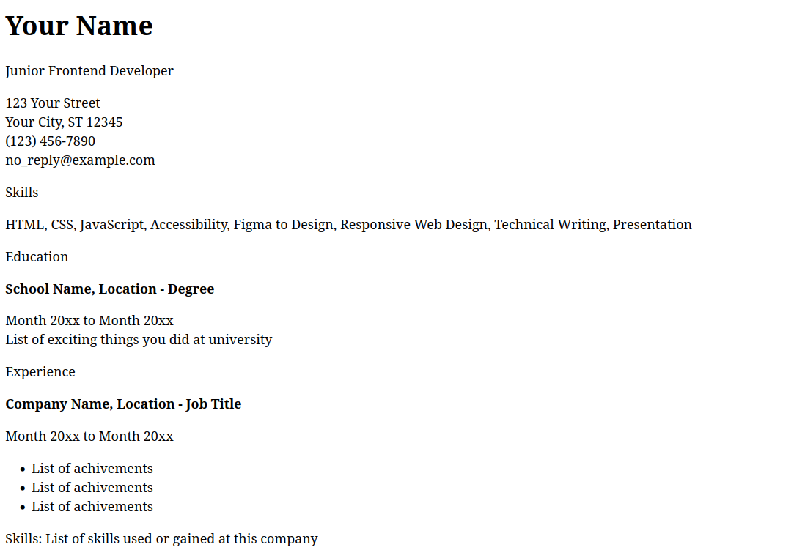
  </a>
  <a href="https://github.com/loihnt05/tailor/tree/main/multiple-pages">
    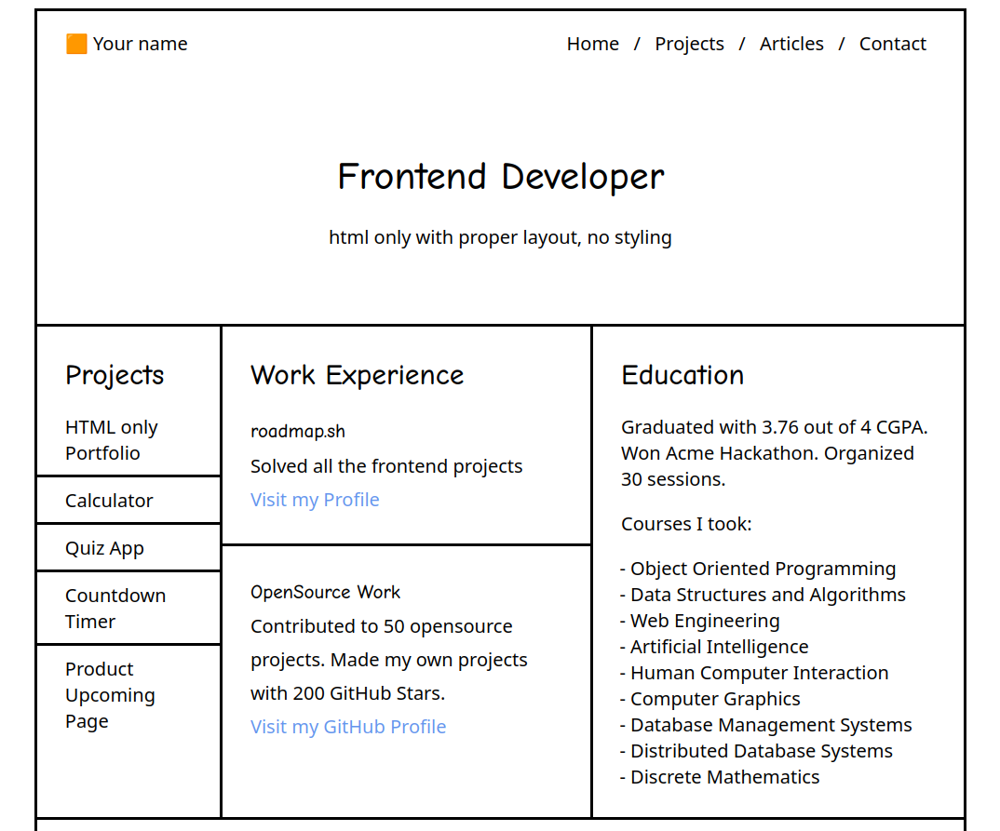
  </a>
  <a href="https://github.com/loihnt05/tailor/tree/main/changelog">
    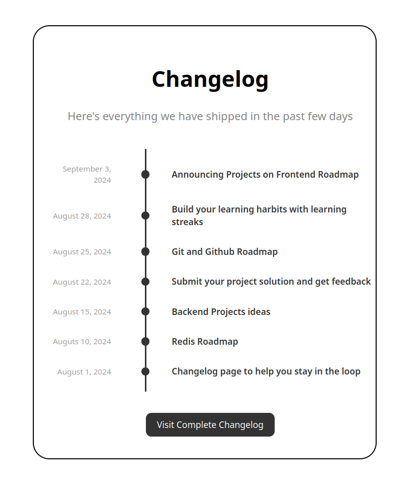
  </a>
  <a href="https://github.com/loihnt05/tailor/tree/main/testimonial-cards">
    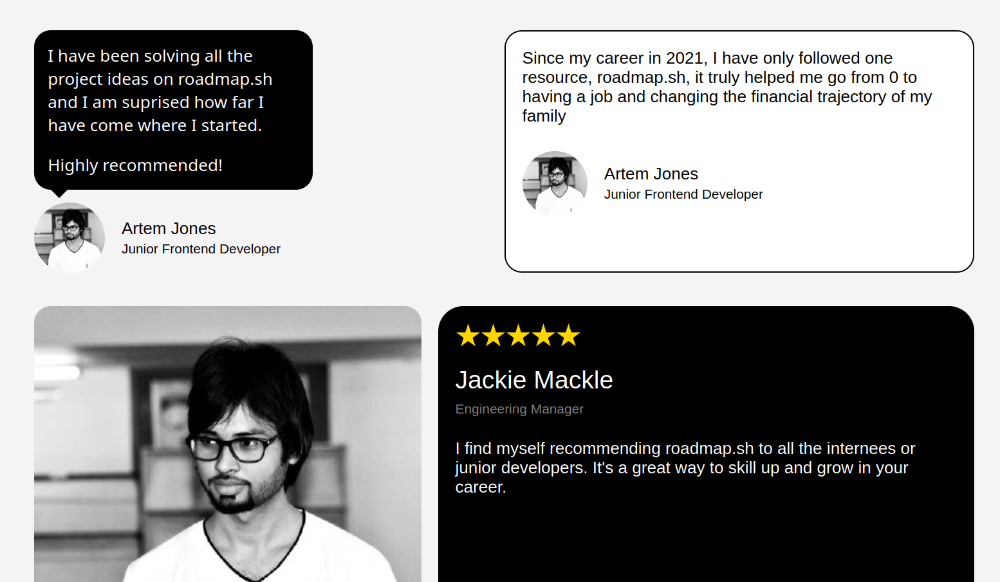
  </a>
  
  <a href="https://github.com/loihnt05/tailor/tree/main/accessible-form">
    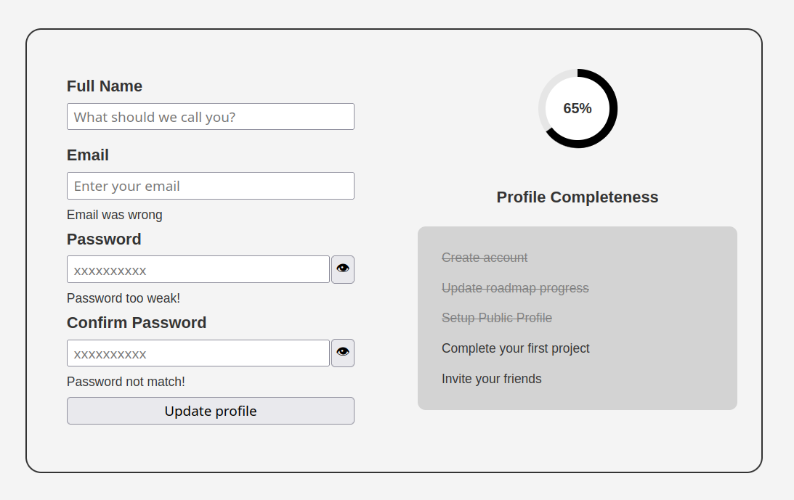
  </a>
  
  <a href="https://github.com/loihnt05/tailor/tree/main/tool-tip">
    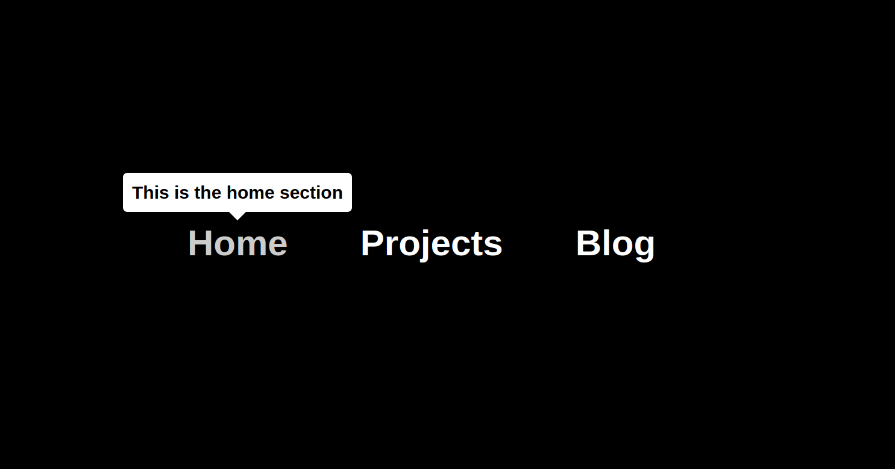
  </a>
  <a href="https://github.com/loihnt05/tailor/tree/main/tabs">
    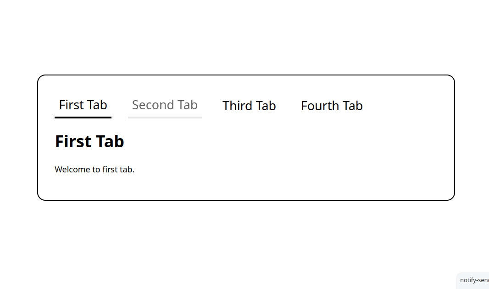
  </a>
  <a href="https://github.com/loihnt05/tailor/tree/main/cookie">
    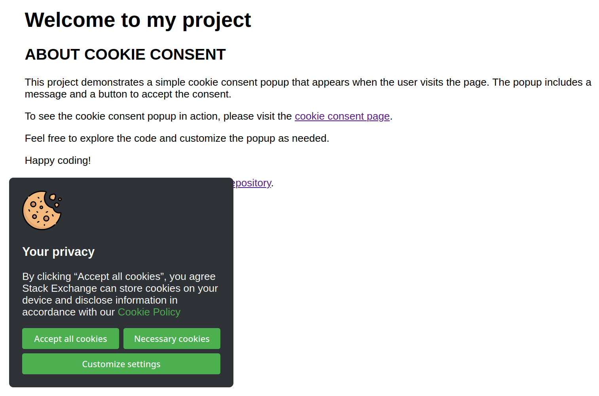
  </a>
  <a href="https://github.com/loihnt05/tailor/tree/main/restricted-textarea">
    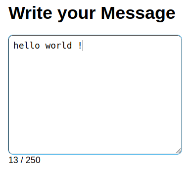
  </a>
  <a href="https://github.com/loihnt05/tailor/tree/main/accordion">
    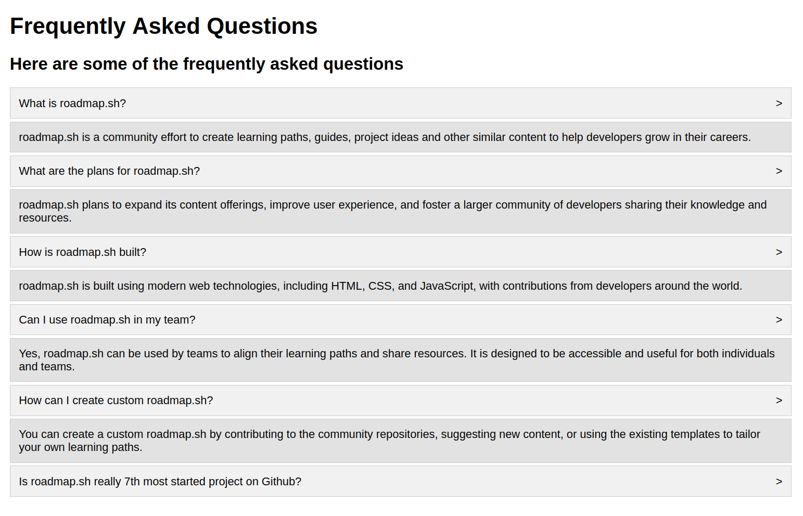
  </a>
  <a href="https://github.com/loihnt05/tailor/tree/main/age-calculator">
    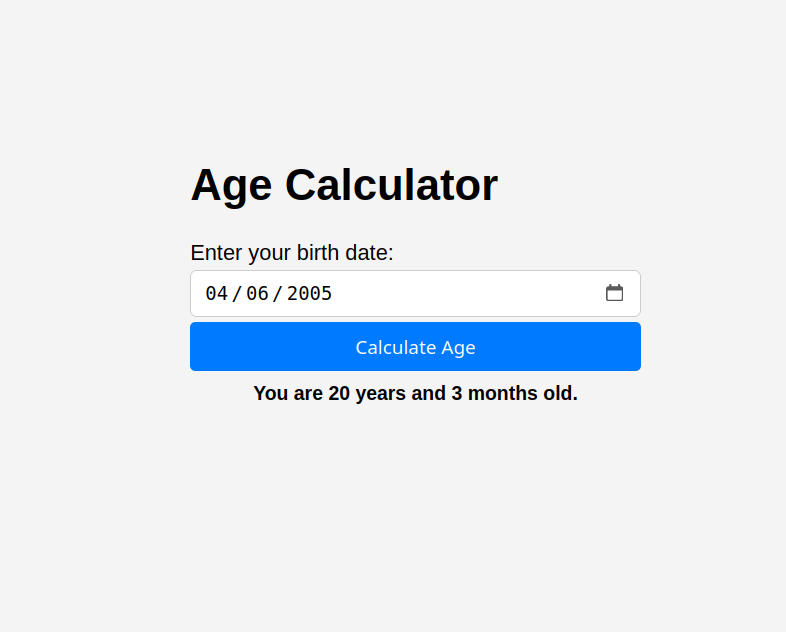
  </a>
  <a href="https://github.com/loihnt05/tailor/tree/main/flash-card">
    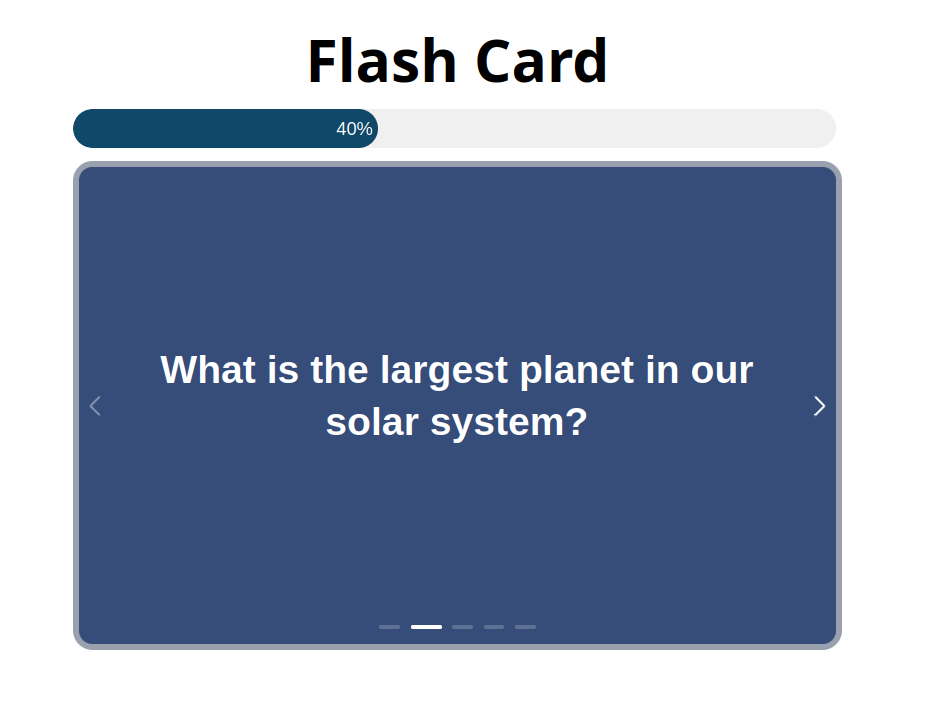
  </a>

  
  
  

  

    Maintained with ☕ & ❤️ by 
    <a href="https://github.com/loihnt05"><strong>TaiLoiHo</strong></a>
     
  
     • Open Source • 
  
   
   © 2025
  

